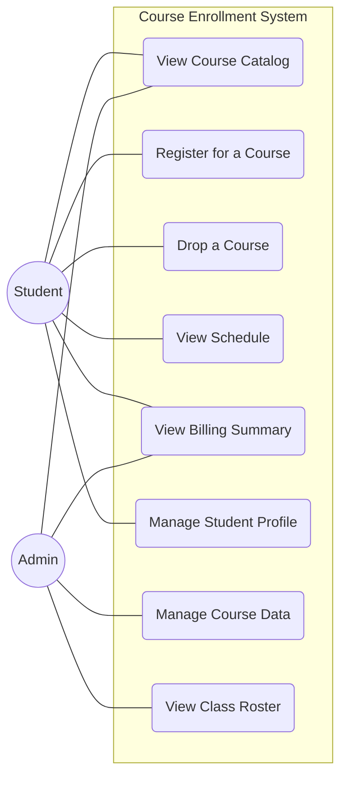
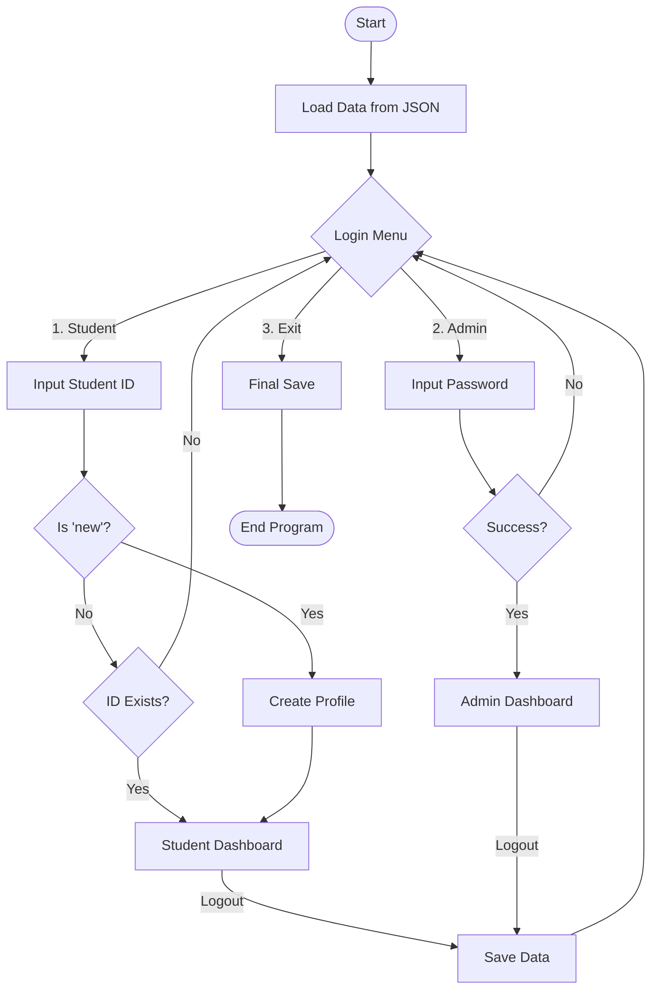

# unknownapp
This is an unknown application written in Java

---- For Submission (you must fill in the information below) ----
### Use Case Diagram

### Flowchart of the main workflow

### Prompts

The following prompts were used with AI assistance:
 
**Prompt 1 — Use case diagram:**
> "Based on this Java Course Enrollment System, generate a Mermaid use case diagram showing all actors (Student and Admin) and their use cases, with proper styling."
 
**Prompt 2 — Mermaid flowchart:**
> "Create a Mermaid flowchart showing the user's flow through the main menu of this Course Enrollment System, including the login menu, student menu, and admin menu.
 
## Technical Implementation Details:
* **Target Use Case:** Course Registration & Validation Logic
* **System Architecture:** Implemented using a Class-based approach to maintain Object-Oriented principles from the original source.
* **Logic Constraints:** * **Capacity Guard:** Prevents enrollment if `enrolled >= capacity`.
    * **Prerequisite Filter:** Scans student history to ensure required course codes are present.
    * **State Management:** Uses local dictionaries to simulate the system's database.
